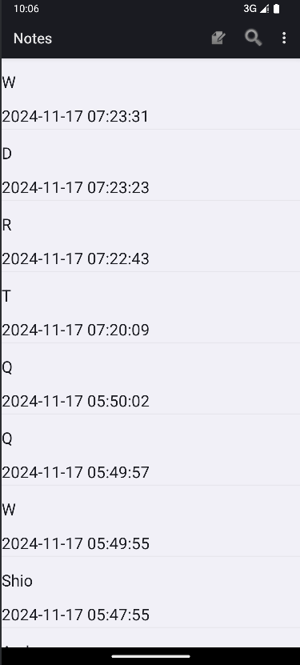
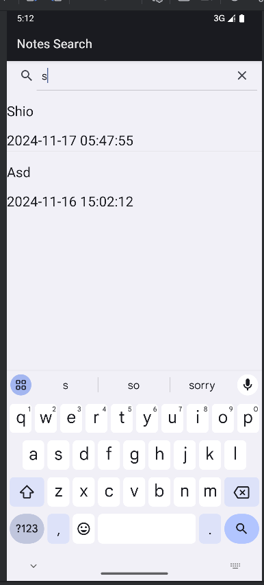
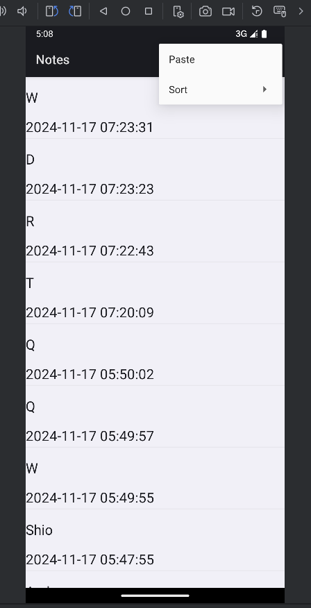
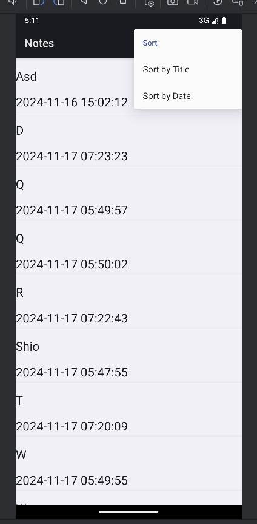
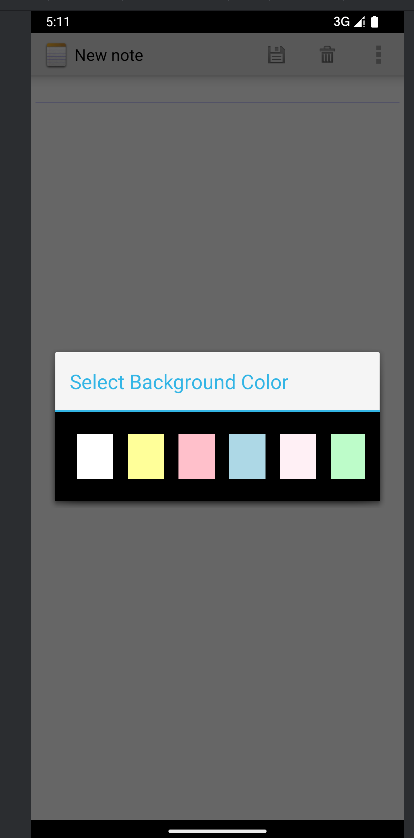
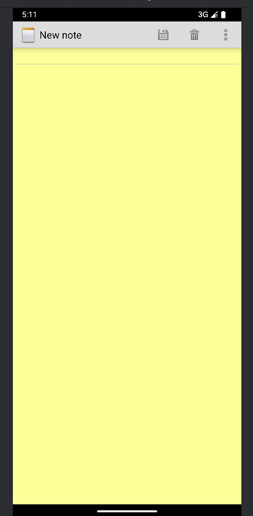

## 添加内容

​		1.时间戳

​		2.搜索

​		3.排序

​		4.-更换背景

### 	1.时间戳

​				1.由于某些不兼容的问题，对适配器进行修改

```java
public class NotesAdapter extends CursorAdapter {

    private LayoutInflater inflater;

    public NotesAdapter(Context context, Cursor cursor, int flags) {
        super(context, cursor, flags);
        inflater = LayoutInflater.from(context);
    }

    @Override
    public View newView(Context context, Cursor cursor, ViewGroup parent) {
        return inflater.inflate(R.layout.noteslist_item, parent, false);
    }

    @Override
    public void bindView(View view, Context context, Cursor cursor) {
        String noteTitle = cursor.getString(cursor.getColumnIndex(NotePad.Notes.COLUMN_NAME_TITLE));
        long timestamp = cursor.getLong(cursor.getColumnIndex(NotePad.Notes.COLUMN_NAME_TIMESTAMP));
        SimpleDateFormat sdf = new SimpleDateFormat("yyyy-MM-dd HH:mm:ss");
        Date date = new Date(timestamp);
        String formattedDate = sdf.format(date);

        // 获取TextView控件并设置内容
        TextView titleTextView = view.findViewById(android.R.id.text1);
        TextView timestampTextView = view.findViewById(android.R.id.text2);

        titleTextView.setText(noteTitle);
        timestampTextView.setText(formattedDate);
    }
}
```

​				2.布局文件

```xml
<LinearLayout xmlns:android="http://schemas.android.com/apk/res/android"
    android:layout_width="match_parent"
    android:layout_height="match_parent"
    android:orientation="vertical"
    android:paddingBottom="3dip">

    <TextView
        android:id="@android:id/text1"
        android:layout_width="match_parent"
        android:layout_height="?android:attr/listPreferredItemHeight"
        android:textAppearance="?android:attr/textAppearanceLarge"
        android:gravity="center_vertical"
        android:singleLine="true"
        />

    <TextView
        android:id="@android:id/text2"
        android:layout_width="match_parent"
        android:layout_height="wrap_content"
        android:singleLine="true"
        android:textAppearance="?android:attr/textAppearanceLarge" />
</LinearLayout>
```

​				3.为数据库表格添加新的时间戳列，更新数据库版本

```java
db.execSQL("ALTER TABLE " + NotePad.Notes.TABLE_NAME + " ADD COLUMN " +
        NotePad.Notes.COLUMN_NAME_TIMESTAMP + " INTEGER");
onCreate(db);
```

​				4.获取当前时间作为时间戳，以下是关键代码

```java
Long now = Long.valueOf(System.currentTimeMillis());
values.put(NotePad.Notes.COLUMN_NAME_TIMESTAMP, now);
```

```java
private static final String[] PROJECTION = new String[] {
        NotePad.Notes._ID, // 0
        NotePad.Notes.COLUMN_NAME_TITLE, // 1
        NotePad.Notes.COLUMN_NAME_TIMESTAMP
};
```

```java
Cursor cursor = managedQuery(
        getIntent().getData(),            // Use the default content URI for the provider.
        PROJECTION,                       // Return the note ID and title for each note.
        null,                             // No where clause, return all records.
        null,                             // No where clause, therefore no where column values.
        NotePad.Notes.DEFAULT_SORT_ORDER  // Use the default sort order.
);

/*
 * The following two arrays create a "map" between columns in the cursor and view IDs
 * for items in the ListView. Each element in the dataColumns array represents
 * a column name; each element in the viewID array represents the ID of a View.
 * The SimpleCursorAdapter maps them in ascending order to determine where each column
 * value will appear in the ListView.
 */

// The names of the cursor columns to display in the view, initialized to the title column
String[] dataColumns = {
        NotePad.Notes.COLUMN_NAME_TITLE,
        NotePad.Notes.COLUMN_NAME_TIMESTAMP
} ;

// The view IDs that will display the cursor columns, initialized to the TextView in
// noteslist_item.xml
int[] viewIDs = { android.R.id.text1,android.R.id.text2};

// Creates the backing adapter for the ListView.
adapter = new NotesAdapter(
        this,
        cursor,
        CursorAdapter.FLAG_REGISTER_CONTENT_OBSERVER
);

// Sets the ListView's adapter to be the cursor adapter that was just created.
setListAdapter(adapter);
```



## 	2.搜索

​				1.布局文件

```xml
<?xml version="1.0" encoding="utf-8"?>
<LinearLayout xmlns:android="http://schemas.android.com/apk/res/android"
    android:orientation="vertical"
    android:layout_width="match_parent"
    android:layout_height="match_parent">
    <SearchView
        android:id="@+id/search_view"
        android:layout_width="match_parent"
        android:layout_height="wrap_content"
        android:iconifiedByDefault="false"
        android:layout_alignParentTop="true">
    </SearchView>
    <ListView
        android:id="@android:id/list"
        android:layout_width="match_parent"
        android:layout_height="wrap_content">
    </ListView>
</LinearLayout>
```

```xml
	<item
    	android:id="@+id/menu_search"
    	android:icon="@android:drawable/ic_search_category_default"
    	android:showAsAction="always"
    	android:title="search"/>
```

​			2.实时更新布局

```java
	@Override
    public boolean onQueryTextChange(String newText) {
        String selection = NotePad.Notes.COLUMN_NAME_TITLE + " Like ? ";
        String[] selectionArgs = { "%"+newText+"%" };
        Cursor cursor = managedQuery(
                getIntent().getData(),
                PROJECTION,
                selection,
                selectionArgs,
                NotePad.Notes.DEFAULT_SORT_ORDER
        );
        String[] dataColumns = { NotePad.Notes.COLUMN_NAME_TITLE ,
                NotePad.Notes.COLUMN_NAME_TIMESTAMP };
        int[] viewIDs = { android.R.id.text1 , android.R.id.text2 };
        NotesAdapter adapter = new NotesAdapter(
                this,
                cursor,
                CursorAdapter.FLAG_REGISTER_CONTENT_OBSERVER
        );
        setListAdapter(adapter);

        return true;
    }
```

​			3.onCreate，监听器

```java
	@Override
	protected void onCreate(Bundle savedInstanceState) {
	    super.onCreate(savedInstanceState);
	    setContentView(R.layout.note_search);
	    Intent intent = getIntent();
	    if (intent.getData() == null) {
	        intent.setData(NotePad.Notes.CONTENT_URI);
	    }
	    SearchView searchview = (SearchView)findViewById(R.id.search_view);
	    searchview.setOnQueryTextListener(NoteSearch.this);
	}
```

```java
	@Override
    protected void onListItemClick(ListView l, View v, int position, long id) {

        Uri uri = ContentUris.withAppendedId(getIntent().getData(), id);
        String action = getIntent().getAction();
        if (Intent.ACTION_PICK.equals(action) || 				                  			  Intent.ACTION_GET_CONTENT.equals(action)) {
            setResult(RESULT_OK, new Intent().setData(uri));
        } else {
            startActivity(new Intent(Intent.ACTION_EDIT, uri));
        }
    }
```



## 	3.排序

​				1.同样是在首页上方菜单栏中添加，因为有两个排序方式所以再嵌套一个menu

```xml
<item
    android:id="@+id/menu_sort"
    android:title="Sort"
    android:showAsAction="never">
    <menu>
        <item
            android:id="@+id/menu_sort_title"
            android:title="Sort by Title" />
        <item
            android:id="@+id/menu_sort_date"
            android:title="Sort by Date" />
    </menu>
</item>
```

​				2.在onOptionsItemSelected中的switch添加两个选项

```java
case R.id.menu_sort_title:
    sortNotes(NotePad.Notes.COLUMN_NAME_TITLE + " ASC");
    return true;
case R.id.menu_sort_date:
    sortNotes(NotePad.Notes.COLUMN_NAME_TIMESTAMP + " DESC");
    return true;
```

​				3.sortNotes方法，交换游标更新适配器

```java
private void sortNotes(String sortOrder) {
    Cursor cursor = getContentResolver().query(NotePad.Notes.CONTENT_URI, null, null, null, sortOrder);
    adapter.swapCursor(cursor);
}
```




## 	4.更换背景

​				1.在文本编辑的菜单栏里添加

```xml
<item
    android:id="@+id/menu_change_background"
    android:title="Select Background Color"
    android:showAsAction="never"/>
```

​				2.使用网格布局显示颜色备选项

```xml
<?xml version="1.0" encoding="utf-8"?>
<GridLayout xmlns:android="http://schemas.android.com/apk/res/android"
    android:layout_width="match_parent"
    android:layout_height="wrap_content"
    android:columnCount="6"
    android:padding="16dp"
    android:background="@android:color/black"
    android:id="@+id/color_grid">

    <View
        android:layout_width="40dp"
        android:layout_height="50dp"
        android:background="#FFFFFF"
        android:layout_margin="8dp"
        android:tag="#FFFFFF"
        android:clickable="true" />

    <View
        android:layout_width="40dp"
        android:layout_height="50dp"
        android:background="#FFFF99"
        android:layout_margin="8dp"
        android:tag="#FFFF99"
        android:clickable="true" />

    <View
        android:layout_width="40dp"
        android:layout_height="50dp"
        android:background="#FFC0CB"
        android:layout_margin="8dp"
        android:tag="#FFC0CB"
        android:clickable="true" />

    <View
        android:layout_width="40dp"
        android:layout_height="50dp"
        android:background="#ADD8E6"
        android:layout_margin="8dp"
        android:tag="#ADD8E6"
        android:clickable="true" />

    <View
        android:layout_width="40dp"
        android:layout_height="50dp"
        android:background="#FFF0F5"
        android:layout_margin="8dp"
        android:tag="#FFF0F5"
        android:clickable="true" />
    <View
        android:layout_width="40dp"
        android:layout_height="50dp"
        android:background="#BDFCC9"
        android:layout_margin="8dp"
        android:tag="#BDFCC9"
        android:clickable="true" />

</GridLayout>
```

​				3.使用对话框在选择更换背景后跳出更换界面

```java
private void showBackgroundColorPicker() {

    AlertDialog.Builder builder = new AlertDialog.Builder(this);
    builder.setTitle("Select Background Color");
    View colorPickerView = getLayoutInflater().inflate(R.layout.dialog_color_picker, null);
    builder.setView(colorPickerView);

    AlertDialog dialog = builder.create();

    ColorClickListener clickListener = new ColorClickListener(dialog);

    @SuppressLint({"MissingInflatedId", "LocalSuppress"})
    ViewGroup gridLayout = colorPickerView.findViewById(R.id.color_grid);
    for (int i = 0; i < gridLayout.getChildCount(); i++)
    {
        View colorView = gridLayout.getChildAt(i);
        colorView.setOnClickListener(clickListener);
    }


    dialog.show();
}
```

​				4.设置监听器获取选择的颜色，并且使用SharedPreferences保存更改的颜色

```java
private class ColorClickListener implements View.OnClickListener {
    private final AlertDialog dialog;

    public ColorClickListener(AlertDialog dialog) {
        this.dialog = dialog;
    }

    @Override
    public void onClick(View view) {
        String color = (String) view.getTag();
        mText.setBackgroundColor(Color.parseColor(color));
        SharedPreferences sharedPreferences = getSharedPreferences("NotePadPreferences", MODE_PRIVATE);
        SharedPreferences.Editor editor = sharedPreferences.edit();
        editor.putString("bg_color_"+noteid, color);
        editor.apply();
        dialog.dismiss();
    }
}
```

​				5.在下次打开后自动恢复

```java
private class ColorClickListener implements View.OnClickListener {
    private final AlertDialog dialog;

    public ColorClickListener(AlertDialog dialog) {
        this.dialog = dialog;
    }

    @Override
    public void onClick(View view) {
        String color = (String) view.getTag();
        mText.setBackgroundColor(Color.parseColor(color));
        SharedPreferences sharedPreferences = getSharedPreferences("NotePadPreferences", MODE_PRIVATE);
        SharedPreferences.Editor editor = sharedPreferences.edit();
        editor.putString("bg_color_"+noteid, color);
        editor.apply();
        dialog.dismiss();
    }
}
```

```java
mText = (EditText) findViewById(R.id.note);
noteid=mUri.getLastPathSegment();
SharedPreferences sharedPreferences = getSharedPreferences("NotePadPreferences", MODE_PRIVATE);
String savedColor = sharedPreferences.getString("bg_color_"+noteid, "#FFFFFF");
mText.setBackgroundColor(Color.parseColor(savedColor));
```


